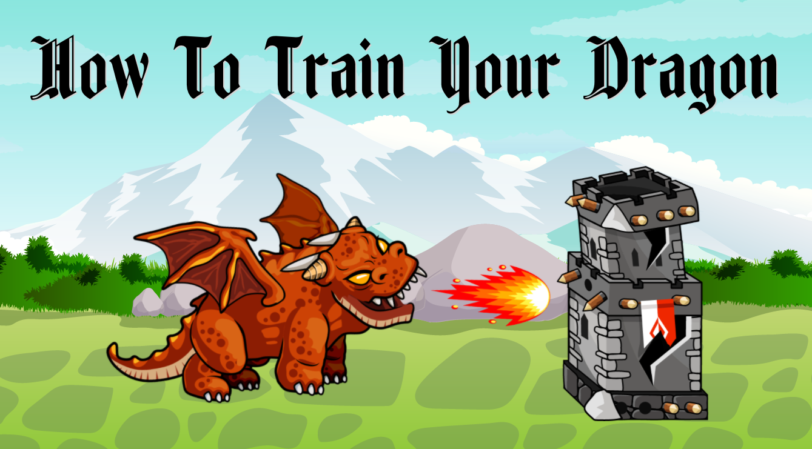
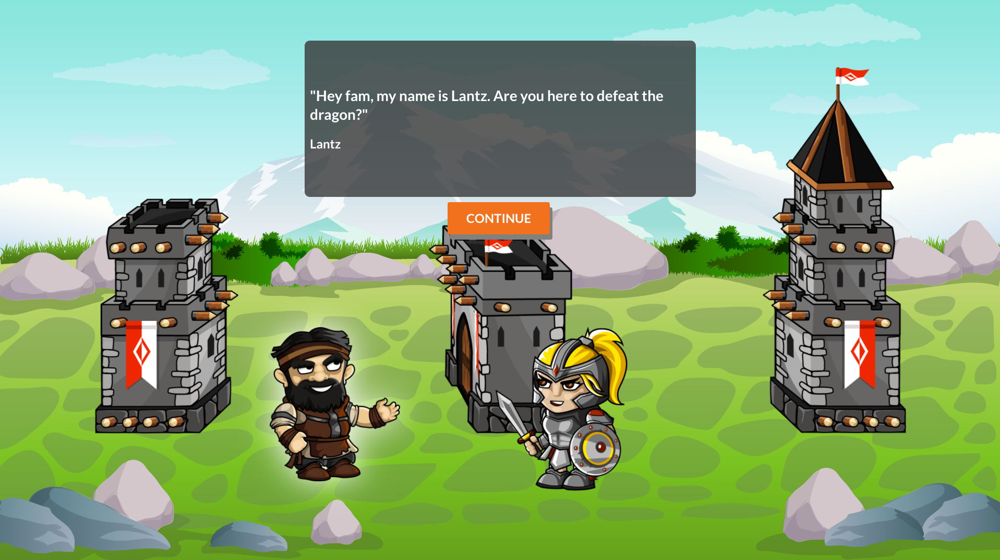
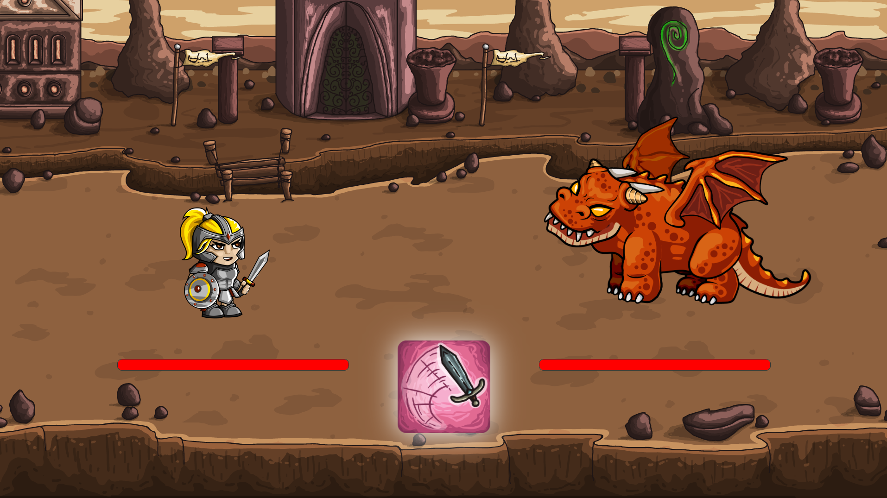
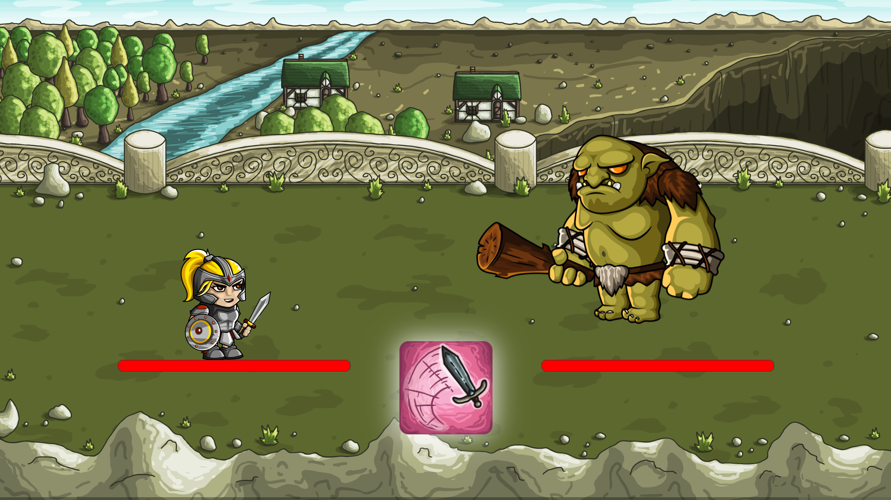
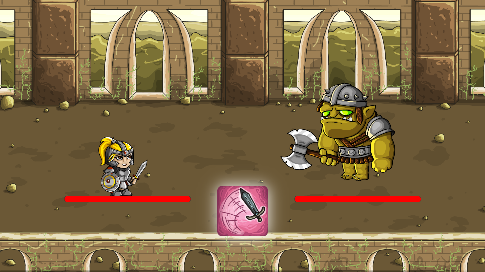
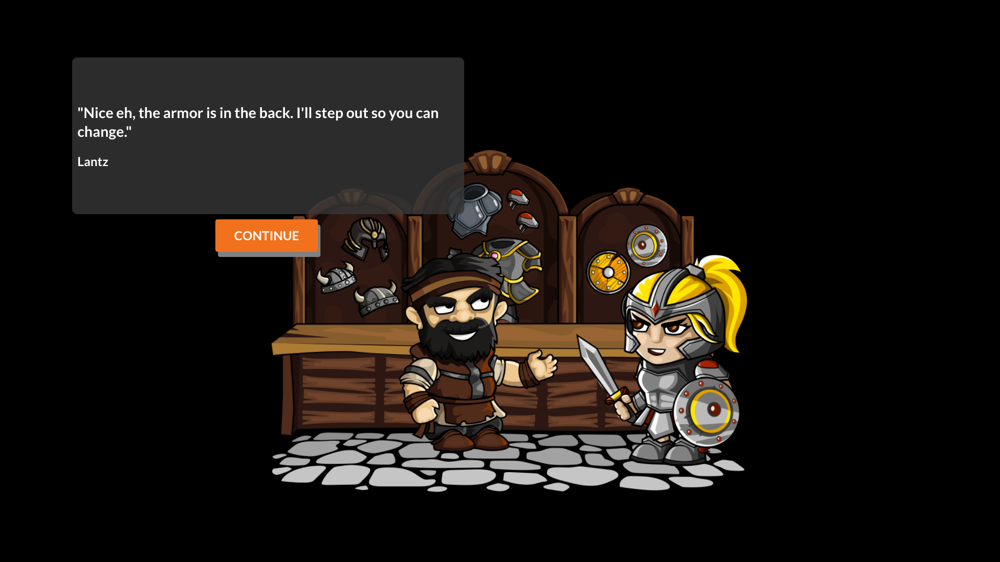
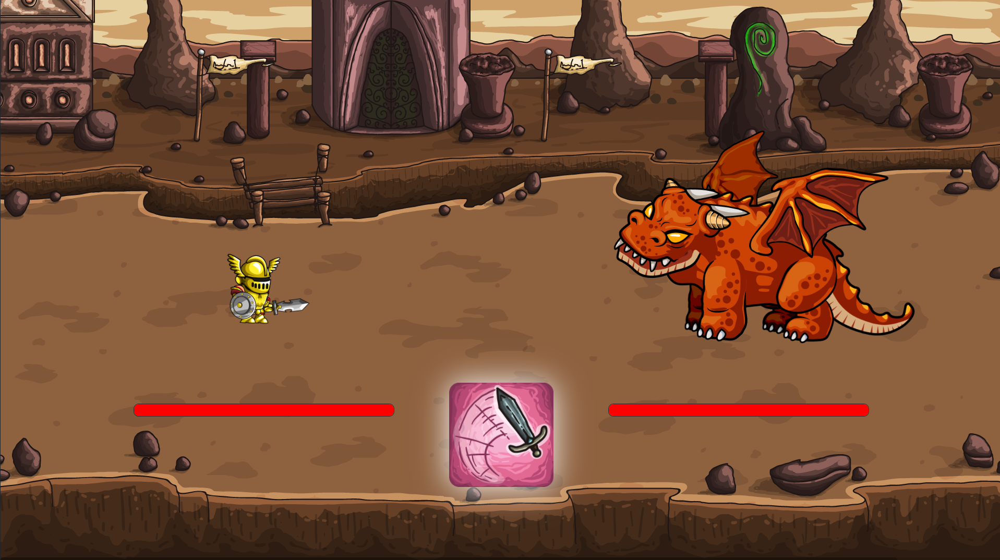

# How To Train Your Dragon

> How To Train Your Dragon is a guided RPG game

## Table of Contents

- [General Info](#general-information)
- [Technologies Used](#technologies-used)
- [Features](#features)
- [Screenshots](#screenshots)
- [Setup](#setup)
- [Project Status](#project-status)
- [Contact](#contact)
<!-- * [License](#license) -->

## General Information

- I created How To Train Your Dragon to create a fun game that told a story and had character progression.
<!-- You don't have to answer all the questions - just the ones relevant to your project. -->

## Technologies Used

- React
- Ruby
- Rake
- Sinatra
- SQL
- Active Record

## Features

- Character progression
- Armor upgrade

## Demo

<!-- If you have screenshots you'd like to share, include them here. -->

## Setup

- Clone the repository to your local machine
- Open project in your editor
- Open terminal from editor or 'cd' to project directory and run:
  - npm install --prefix client
  - npm start --prefix client

Backend: https://github.com/vincentbaylon/rpg-backend

- Clone the repository to your local machine
- Open project in your editor
- Open terminal from editor or 'cd' to project directory and run:
  - bundle install
  - rake db:migrate db:seed
  - bundlex exec rake server

## Project Status

Project is: _complete_

## Contact

Created by [@vincentbaylon](https://www.linkedin.com/in/vincentbaylon) - feel free to contact me!

<!-- Optional -->
<!-- ## License -->
<!-- This project is open source and available under the [... License](). -->

<!-- You don't have to include all sections - just the one's relevant to your project -->
